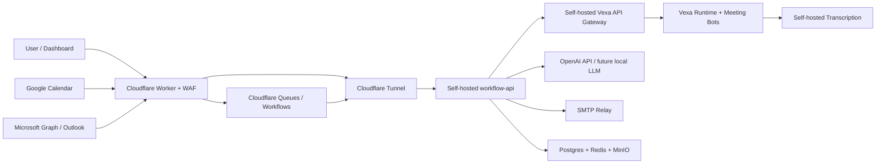

# Cloudflare-First Vexa Meeting Assistant Architecture

## Summary

Build a Cloudflare-fronted, self-hosted Vexa product for transcription, Google/Outlook calendar meeting creation, task extraction, and SMTP mail. Cloudflare is the control/edge plane; Vexa, Postgres, Redis, transcription, SMTP delivery, and durable app state run on a self-managed VM. Supabase is not used in v1. For fast launch, task extraction uses OpenAI API; local LLM inference remains a later fallback option.

Cloudflare can be used, but not as the only host for Vexa. Vexa's runtime depends on Postgres, Redis, long-running bot execution, and Docker/Kubernetes/process orchestration. Cloudflare Containers are useful for edge-adjacent services, but v1 should keep Vexa runtime on the VM and use Cloudflare for DNS, WAF, Access, Tunnel, Workers, Queues, and webhook entrypoints. Cloudflare Containers are now documented as available on Workers Paid, with predefined/custom instance limits up to 4 vCPU, 12 GiB memory, and 20 GB disk, so they are not the first target for GPU transcription or local LLM inference.

Sources:

- [Cloudflare Containers](https://developers.cloudflare.com/containers/)
- [Cloudflare Container limits](https://developers.cloudflare.com/containers/platform-details/limits/)
- [Vexa compose deployment](vexa-review/deploy/compose/README.md)

## Key Changes

- Add a new self-hosted `workflow-api` service beside Vexa.
  - Owns Google OAuth, Microsoft Graph OAuth, calendar event creation, calendar sync, task extraction, SMTP sending, and meeting-summary workflows.
  - Stores tokens encrypted in self-hosted Postgres, not in `users.data` JSONB.
  - Calls Vexa API Gateway for bot scheduling and transcript retrieval.
- Use Cloudflare as public control plane.
  - Cloudflare DNS/WAF/Access protects public routes.
  - Cloudflare Tunnel exposes only the VM services needed by the edge Worker.
  - Cloudflare Worker receives public OAuth callbacks, calendar webhooks, Vexa webhooks, and user-facing API traffic, then forwards validated requests to `workflow-api`.
  - Cloudflare Queues/Workflows handle retryable async jobs using IDs only; durable transcript/task data stays in Postgres.
- Run self-hosted execution/state plane on one Linux VM for v1.
  - Vexa Docker Compose stack: API Gateway, Meeting API, Runtime API, Admin API, Dashboard, Redis, Postgres, MinIO.
  - Self-hosted transcription service on GPU if available; CPU only for low-concurrency testing.
  - OpenAI API for fast-launch summaries and task extraction; self-hosted LLM service can replace it later.
  - SMTP relay configured by environment variables and verified with a test endpoint.
- Keep Vexa source changes small.
  - Do not modify `vexa-bot` for calendar/tasks/mail.
  - Enable or replace the experimental `calendar-service`; preferred path is replacing it with provider-neutral `workflow-api`.
  - Use Vexa webhooks or post-meeting callbacks to trigger task extraction.

## Public Interfaces

### `POST /workflow/meetings`

Creates a Google Calendar or Outlook event, adds conferencing, stores the event, optionally schedules a Vexa bot.

Request fields:

- `provider`
- `title`
- `start_time`
- `end_time`
- `timezone`
- `attendees`
- `agenda`
- `auto_join`
- `send_invites`

### `GET /workflow/meetings`

Lists created/synced meetings with provider status, Vexa bot status, transcript status, and summary/task status.

### `POST /workflow/webhooks/vexa/meeting-completed`

Idempotently receives Vexa completion events, fetches transcript, runs OpenAI-backed extraction, stores summary/tasks, and queues email.

### `GET /workflow/tasks` and `PATCH /workflow/tasks/{id}`

Lists and updates assigned tasks.

### `POST /workflow/mail/test`

Verifies SMTP credentials without sending meeting data externally.

## Core Tables

- `integration_accounts`: user, provider, encrypted OAuth tokens, scopes, expiry.
- `calendar_events`: provider event IDs, conferencing URL, Vexa meeting ID, sync status.
- `meeting_outputs`: transcript reference, summary, decisions, generated timestamps.
- `tasks`: meeting ID, owner email, title, due date, status, confidence.
- `email_deliveries`: recipients, template, status, retries, SMTP response.

## Data Flow

## Test Plan

### Unit Tests

- Google/Microsoft OAuth token refresh and encrypted token storage.
- Calendar URL extraction, provider event mapping, and idempotent upserts.
- Vexa webhook signature/secret validation and duplicate webhook handling.
- Task extraction parser against fixed transcript fixtures.
- SMTP success, auth failure, retryable failure, and permanent failure.

### Integration Tests

- Mock Google Calendar and Microsoft Graph APIs.
- Mock Vexa `/bots` and `/transcripts` APIs.
- End-to-end: create calendar meeting -> schedule bot -> receive completion webhook -> fetch transcript -> generate tasks -> send summary email.

### Deployment Checks

- `docker compose` health checks for Vexa, workflow-api, Postgres, Redis, MinIO, transcription, and LLM.
- Cloudflare Worker route smoke tests.
- Cloudflare Tunnel connectivity test from Worker to `workflow-api`.
- No transcript text persisted in Cloudflare Queues; queue payloads contain IDs only.

## Assumptions

- Cloudflare-managed infrastructure is acceptable for edge routing and transient queue/control metadata.
- Durable meeting data, recordings, OAuth tokens, summaries, tasks, and transcription remain on the self-managed VM. Transcript text is sent to OpenAI for task extraction while `LLM_PROVIDER=openai`; local LLM fallback is deferred.
- Google Calendar and Microsoft Graph are necessarily external trust boundaries because creating/syncing calendar meetings requires their APIs.
- Supabase is excluded from v1.
- Cloudflare Containers are not the v1 Vexa runtime target; they can be evaluated later for small stateless helpers or connector workers, not for GPU transcription, local LLM, or the Vexa bot fleet.
